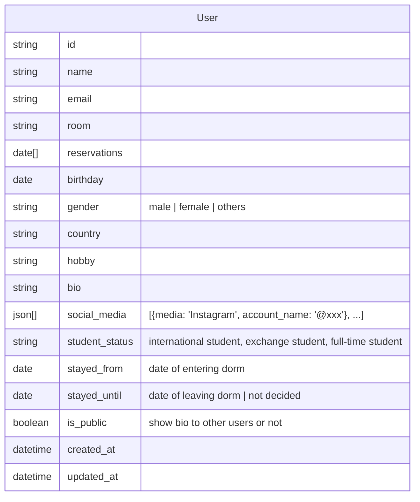

# Installation

```
poetry env use python
poetry install
```

## Running a server

Run from server/, where pyproject.toml exist

```
poetry shell
uvicorn api.main:app --reload
```

## Coding rule

Using below command to check code before push

```
isort .
black api
flake api
```

## Serverless cron task

Running task from local

```
sls invoke local -f reservationHandler
```

## Bio data

Maybe adding furigana to name (only for japanese) and separating first name and last name (maybe middle name is required?) (last name is nullable because some doesn't have it?)

How should generation be added? (1 期生、2 期生 or enter the date and calculate it?)

As the privacy problem, we maybe not showing room, social media, etc. for other user not logging in.


